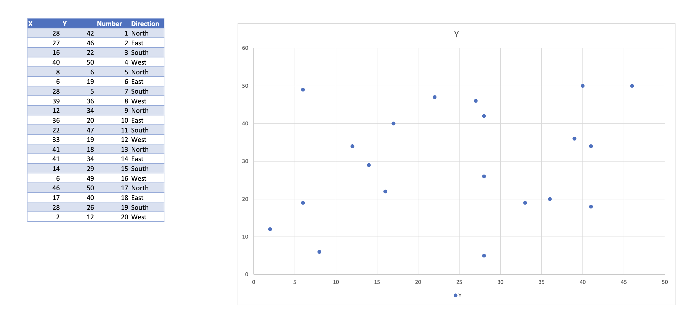

# Gaming Test

Imagine we have a playing field:


1. Set up an object which represents a `PlayingField`. A playing field will contain
information about which points are present in the game.
2. Set up an object which represents a `Point`. Each point will come with a direction. Each
point must also be associated with a playing field.
3. For each point, define a method which calculates the set of other points which are inside
the field of vision.

The image below gives an idea of what's going on visually:


## Instructions to run
You can adjust the values of `angle` and `distance` in `visible_points.py`.

To check the program works, just run 
```
python visible_points.py
```
You may need to install `requirements.txt` to make sure you have pandas installed.

Sample output:
```
gaming-test % python visible_points.py
enter a point id: 1
enter an angle: 45
enter a distance: 20
-------
Points in the visible range of 1: [2]
```

